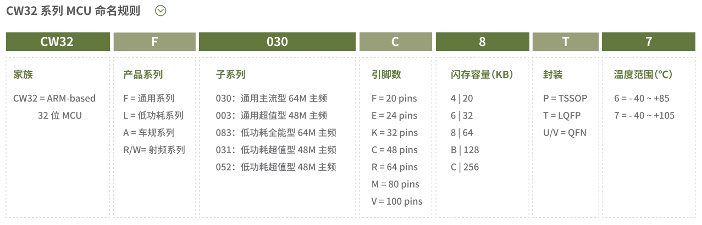
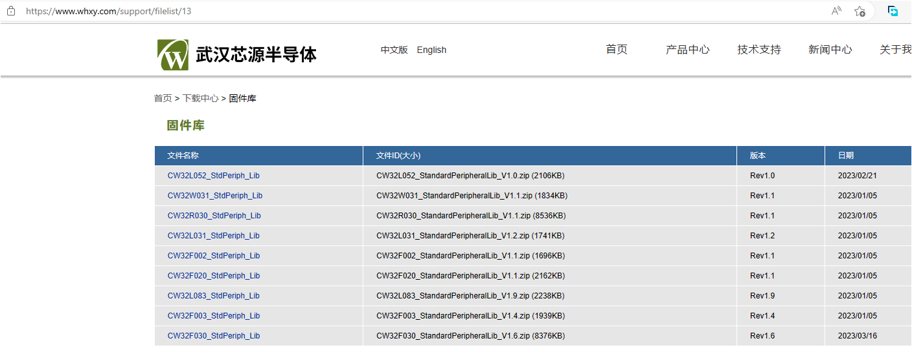
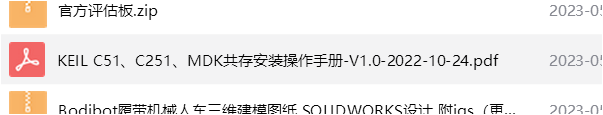

CW32常见问题一览  
===============
by流浪剑士 2023.6.24  
本文档旨在收集新手入门时的遇到各种问题和相应解决方法，芯源官网有个入门手册，建议先看一下，文档中涉及的文件度盘链接：  
链接：https://pan.baidu.com/s/1tUGW5rmnOdn8aI2LJ-ICTQ?pwd=d12l  
提取码：d12l  
  

目录  
===
[TOC]

## CW32系列命名规则  

## 开发环境的安装  
开发要用MDK，建议安装5.36版本，这个版本有AC5编译器，之后的版本不再集成  
安装CW32的pack包，可以从武汉芯源官网下载固件库  
https://www.whxy.com/support/filelist/13  
  
pack包在压缩包里，直接双击安装即可  
  

## MDK C251 C51共存  
可以参考群文件里的教程  
  
不过本人没有按照这个来装，现装了MDK5.38a，印象中是C251和C51装到最后询问是否替换文件时都选了不替换  

## AC5编译器的安装  
CW32要用AC5编译器，用AC6编译会报错，可能是这样的错误，还有一堆的警告  
  
MDK5.37开始已经不集成AC5了，想用最新版本有两个方法：  
**方法1：** 最简单的方法是先安装5.36再安装最新版本，这样AC5可以自动集成到MDK中。  
**方法2：** 安装最新版本后手动添加AC5编译器  
下载这个文件并解压出来  
  
安装完MDK后把ARMCC文件夹手动放到keil安装目录的ARM文件夹中  
  
然后在keil中手动添加，选择刚刚添加的文件夹  
  
  
