[TOC]

## 文档编写目的 
本文档旨在收集新手入门时的遇到各种问题和相应解决方法，芯源官网有个入门手册，建议先看一下，文档中涉及的文件度盘链接：  
链接：<https://pan.baidu.com/s/1tUGW5rmnOdn8aI2LJ-ICTQ?pwd=d12l>  
提取码：d12l  
  

## CW32系列命名规则  

## 开发环境的安装  
开发要用MDK，建议安装5.36版本，这个版本有AC5编译器，之后的版本不再集成  
安装CW32的pack包，可以从武汉芯源官网下载固件库  
<https://www.whxy.com/support/filelist/13>  
  
pack包在压缩包里，直接双击安装即可  
  

## MDK C251 C51共存  
可以参考群文件里的教程  
  
不过本人没有按照这个来装，先装了MDK5.38a，印象中是C251和C51装到最后询问是否替换文件时都选了不替换  

## AC5编译器的安装  
CW32要用AC5编译器，用AC6编译会报错，可能是这样的错误，还有一堆的警告  
  
MDK5.37开始已经不集成AC5了，想用最新版本有两个方法：  
**方法1：** 最简单的方法是先安装5.36再安装最新版本，这样AC5可以自动集成到MDK中。  
**方法2：** 安装最新版本后手动添加AC5编译器  
下载这个文件并解压出来  
  
安装完MDK后把ARMCC文件夹手动放到keil安装目录的ARM文件夹中  
  
然后在keil中手动添加，选择刚刚添加的文件夹  
  
  

## 针对AC6编译器的适配  
如果不想折腾安装AC5编译器，可以对现有工程代码修改以适应AC6的编译规则  
CW32的例程直接用AC6编译的话一般会报这个错误  
  
AC6中__weak这个关键字不能被识别，改为__WEAK就好了，关键字的不同可以看这个图  
  
更多的关于MDK适配AC6的内容可以下载KEIL官方的文档进行查看  
<https://developer.arm.com/documentation/kan298/latest/>  
或者看ARM的AC6介绍，里面也有说明如何从AC5转向AC6  
<https://developer.arm.com/documentation/100068/latest/>  

## 用AC6编译有中文的代码会报-Winvalid-source-encoding的警告  
  
可以在下方如图位置填入-Wno-invalid-source-encoding 将该警告信息屏蔽  
  

## 例程移动之后编译失败  
官方例程的库函数文件没有包含在工程目录中，建议复制库函数文件夹到工程目录并删除原来的库函数文件重新添加  
  
另外还要修改头文件包含路径，以这个工程目录为例  
  
要修改成这样  
  
如果懒得自己整合库文件，可以下载群文件或网盘中的工程模板，里面已经整合好库文件  
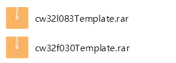  

## 不使用例程或模板，从头新建一个CW32的点灯工程  
先创建一个文件夹，把官方库和启动文件放进去，可以按照自己喜欢的工程创建额外的文件夹  
  
打开Keil，选择project-new uVision Project  
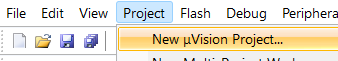  
选择刚才创建的文件夹  
  
在接下来的窗口中选择你要用到的芯片  
  
在接下来的窗口中勾选  
  
按照自己喜好在工程内创建分组  
  
引入必要的库文件  
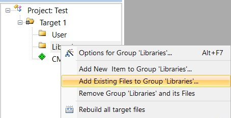  
选择工程目录下的Libraries\src中的文件  
  
你可以直接全部添加，也可以只添加自己需要的，其中system_cw32f030.s在工程目录根目录下，这里只添加了点灯必要的  
  
添加库头文件路径  
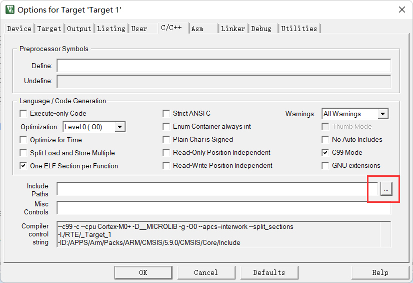  
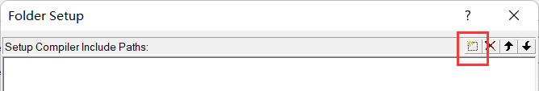  
这里可以手动输入路径或者点击右面的...选择文件夹  
  
选择工程目录中的Libraries\inc文件夹  
  
keil会自动转为相对路径  
  
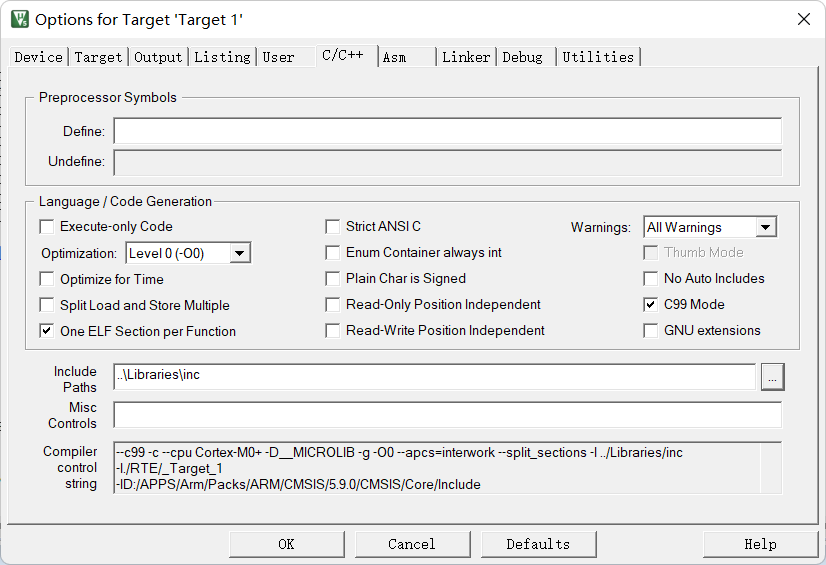  
如果有自己定义的头文件需要包含，也可以按照上面的流程添加，如果想使用绝对路径直接在这个界面输入路径即可，路径间用英文的;分隔  
  
接下来配置工程其它参数，仿照官方工程的参数配置即可  
  
  
  
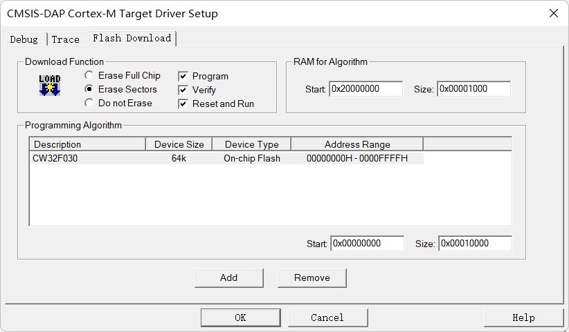  
接下来创建一个main.c文件  
  
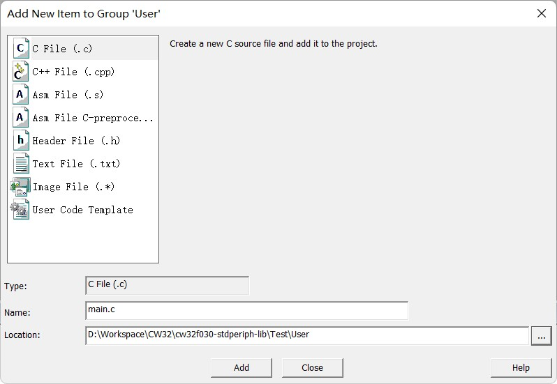  
在新建的main.c中写好点灯用的代码，编译并烧录运行  
  

## 编译报cmsis_version.h或__COMPILER_BARRIER的错误  
  
  
这两个都和CMSIS CORE有关，要勾选如下选项，例程里应该已经默认勾选了，注意CORE的版本，低于5.1.0勾上也还会报错，可以尝试安装网盘或群文件里的ARM.CMSIS.5.9.0.pack或者直接升级MDK  
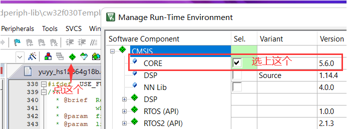  
ARM.CMSIS.5.9.0.pack的发布地址  
<https://github.com/ARM-software/CMSIS_5/releases>  
或者  
<https://www.keil.arm.com/packs/cmsis-arm/versions/>  

## 编译报找不到assert_failed的错误  
  
多见于自己新建的工程，两个解决方法：  
**方法1：** main.c中添加  
\#ifdef  USE_FULL_ASSERT  
void assert_failed(uint8_t *file, uint32_t line)  
{  
}  
\#endif   
**方法2：** 在base_types.h中注释掉下面的内容  
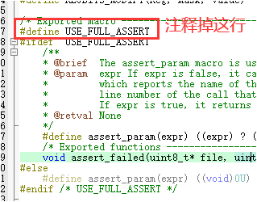  

## 编译报L6200E:Symbol xxxx multiply defined错误
**第1种**  
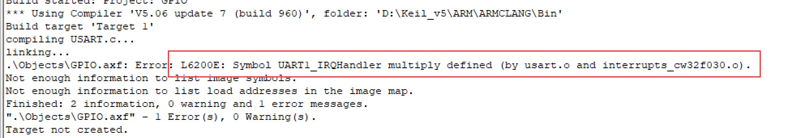  
上图的错误是某个函数被重复定义了，例如你在a.c里定义了函数void func()，在b.c里也定义了一个void func()编译时就会出现这个错误，可以根据提示到相应的源文件里修改或删除重复定义的函数。对于图中这个示例是usart.c和interrupt_cw32f030.c中都定义了UART1_IRQHandler这个函数，删掉一个即可。interrupt_cw32f030.c是官方例程提供的一个统一的中断函数入口，如果你在编程中想要在自己的文件重处理中断可以删除这个文件来避免重复定义的问题。  
**第2种**
  
这个图的错误是system_cw32f030.c在工程中被重复包含了，删除重复的只保留一个即可  

## 编译报No space in xxxxx的错误  
  
检查一下这里的配置，如果和下图配置一样的话还有这个错误那可能真的是代码超了，想办法精简一下代码  
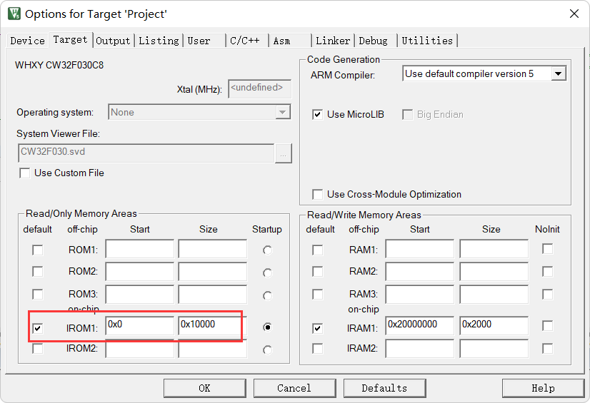  

## 编译报incomplete type is not allowed  
  
如果报错发生在库函数中，有可能是工程设置中的C99 Mode没勾选  
  

## 烧录失败，提示Could not load file xxxxx.axf  
检查是否已经编译成功，一些新入门不熟悉开发环境的可能打开工程后直接烧录就会出现这个错误  
  
在编辑完代码后要先点击编译，编译成功后才能烧录  
  
编译失败会显示Target not created，如下图  
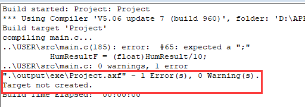  
这时候就需要按照提示的错误信息修改代码并重新编译，编译成功如下图，这时就可以进行烧录了  
  

## 烧录失败  
查看是否选择了正确的烧录器  
  
烧录器的设置，端口这里要选SW  
  
检查连线，SWD(SWIO)接PA13 SWCK连接PA14  
  
连接正确这里会显示  
  
再查看是否选择了正确的烧录算法  
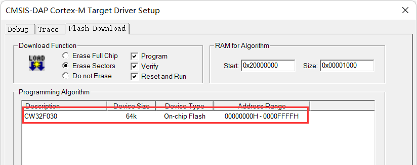  
如果烧录时提示找不到FLM文件  
  
有两个解决方法：  
**方法1：** 可以手动复制FLM文件到这个文件夹  
  
安装完pack文件后flm文件可以在这个位置找到  
  
**方法2：** 把原来的算法文件删掉重新添加，列表里找不到CW32的请确认是否安装了pack，如果已安装请确认device标签中芯片是否选择正确，如果芯片也选择正确尝试点击ok关闭工程配置窗口后再重新打开  
   
  

## 如何进行ISP下载  
如果PA13 PA14被配置成普通IO导致SWD烧录不能识别，或者手头没有SWD的烧录器，可以通过串口进行ISP下载  
要进入ISP烧录模式需要将BOOT引脚上拉后再通电  
  
PA13连接串口工具的TX，PA14连接串口工具的RX  
注意：针对F030要多用一根线连接串口工具的RST或DTR到芯片的RST，请注意使用的串口工具是否有RST引脚，烧录全程需要保持BOOT上拉  
打开CW32_Pragrammer，这个软件可以在武汉芯源官网下载，网盘里也有，官网下载地址<https://www.whxy.com/support/filelist/18>  
  
选择串口后点击连接  
  
选择好芯片和固件后点击在线编程即可完成烧录  
  
注意：针对F030供电连接那里要选择 目标芯片自供电，RST复位  
烧录成功，感觉比用daplink还快  
  

## 饭盒派的屏幕不亮  
烧录器SWD的3.3V带不动屏幕背光，用TYPE-C数据线外接个5V供电即可  

## 小蓝板没有晶振  
没有晶振不影响使用，使用芯片内置时钟就够了，绝大部分例程也都是用的内部时钟  

## 烧录器指示灯颜色和视频或手册介绍不一样  
指示灯颜色不影响烧录器功能，能正常烧录就行  

## 程序烧录完成后不运行  
检查一下这个选项有没有勾上，没勾上的话需要手动复位或重新上电  
  

## 编译烧录了从官网下载的gpio_blink例程但是小蓝板指示灯或大学板底板指示灯没有闪烁  
官方例程的gpio_blink中配置的GPIO是PB8和PB9，小蓝板指示灯连接的是PC13，大学板底板上的3个指示灯连接的是PC13 PA7 PA8，可以下载群文件中大学板的例程，或者自己修改，自己修改的话直接修改宏定义中的GPIO和PIN，然后修改main函数中的端口时钟开启函数  
  
  

## 串口接收到的数据与程序内发送的数据不同  
  
这个可能是串口时钟没设置对，上图里的这个问题，他的RCC时钟设置是这样的  
  
虽然倍频了但是没切换和更新系统时钟，系统还是按照8M的频率在跑，而串口时钟频率设置的是64M，所以传输会出错，完整的应该是这样的  
  
在使用串口时要注意串口时钟频率要和系统时钟频率一致  

## 设置HSI为1分频后程序不运行  
CW32F030在main函数的开头使用RCC_HSI_Enable(RCC_HSIOSC_DIV1);将HSI设置为1分频，结果程序不能运行，调试发现卡在RCC_HSI_Enable方法中  
  
切换时钟要同步配置，配置为1分频后时钟为48MHz，因CW32的 FLASH 存储器支持最快 24MHz 的操作时钟，故需要配置插入的等待 HCLK 周期个数，且此操作必须在时钟频率切换之前执行   
在设置HSI分频实需要根据HSIOC的频率计算一下分频后的频率，如果分频后频率大于 24MHz就要在RCC_HSI_Enable()之前设置一下FLASH读等待周期  
因此要配置成1分频的话需要这么写  
//< 当使用的时钟源HCLK大于24M,小于等于48MHz：设置FLASH 读等待周期为2 cycle >  
__RCC_FLASH_CLK_ENABLE();  
FLASH_SetLatency(FLASH_Latency_2);  
/* HSI使能并校准 */    
RCC_HSI_Enable(RCC_HSIOSC_DIV1); //1分频要在设置之前设置FLASH读等待周期    

## PLL倍频后程序不运行  
以这个为例，不注释红框中的代码程序就不运行  
  
原因和上面一样，倍频超过了24M，在切换时钟前需要设置一下FLASH读等待周期，在RCC_SysClk_Switch(RCC_SYSCLKSRC_PLL);之前插入如下代码  
//< 当使用的时钟源HCLK大于24M,小于等于48MHz：设置FLASH 读等待周期为2 cycle >  
__RCC_FLASH_CLK_ENABLE();  
FLASH_SetLatency(FLASH_Latency_3);  
可设置的参数，需要根据你设置的频率进行调整  
  

## KEIL内调用外部编辑器  
有人不喜欢KEIL的内置编辑器，可以用这个方法调用外部编辑器来写代码  
以VSCode为例，点击KEIL Tools里的这个选项  
  
在弹出的窗口中输入  
  
配置好后在Tools中就会有你刚刚输入的名称  
  
点击它就会用VSCode打开你当前在KEIL中正在编辑的文件，不过要注意的是KEIL的默认编码是GB2312而VSCode是utf8，打开包含中文的文件中文会乱码，建议修改成一致的编码，或者在VSCode的设置中勾选这个  
  

## 在VSCode中编辑编译和烧录  
VSCode有个插件，可以在VSCode中打开KEIL工程并编译和烧录  
在VSCode的扩展商店中搜索keil，安装下方红框标注的插件，下载最多的那个已经不更新了  
  
安装好后到插件设置中填好KEIL的安装目录  
  
在KEIL中建立好工程并正确配置烧录器后，点击这个图标  
  
选择keil的工程文件  
  
打开后就能在VSCode里编辑代码编译和烧录了，三个按钮从左起依次是编译、下载、重新编译  
  
控制台输出的内容与在KEIL中一致  
  
但是烧录没有进度条  
  
注意：这个插件没法脱离KEIL使用，做不到在VSCode中直接建立工程或调试  

## JLINK JFLSH添加CW32的芯片支持  
下载jlinkjflash添加CW32支持.rar文件并解压，JLINK JFLAH7.70D以上的版本将解压出来的JLinkDevices文件夹放入C:\Users\你的用户名\AppData\Roaming\SEGGER  
  
（旧版本未验证）旧版本的将JLinkDevices文件夹内的WHXY文件夹复制到JLINK安装目录的Device文件夹中，并将WHXY文件夹内的xml文件中的<Device>……</Device>的内容复制添加到JLINK安装目录中的JLinkDevices.xml中，在flm的文件名前加上Device/WHXY/，添加完成的JLinkDevices.xml如下  
  
之后在用JFLASH烧录或者MDK中用JLINK时，CW32F030C8 CW32F030F8 CW32F030K8的芯片选择CW32F030x8；CW32L083VC CW32L083LC CW32L083RC的芯片选择CW32L083xC
需要其它芯片型号支持的可以参照修改  
  
烧录CW32F030C8  
  

## VSCode+MSYS2+arm-none-eabi开发环境的搭建  
安装MSYS2，下载地址https://www.msys2.org/，网盘链接里有下载好的  
建议断网安装，不然可能会在这里卡一段时间  
  
在VSCode中添加MSYS2 shell，打开终端设置  
  
找到如下选项并点击  
  
在图示位置添加，修改path的路径为自己安装MSYS2的路径，-mingw64那个参数也可以修改为其它的，具体的参数可以打开msys2_shell.cmd查看  
  
完成后可以在VSCode中打开MSYS2 SHELL  
  
先执行命令pacman -Syu 更新  
  
更新完成后执行命令pacman -S make 安装make工具  
执行命令pacman -S mingw-w64-x86_64-arm-none-eabi-toolchain 安装工具链，默认安装即可  
后面调试时发现这个包的gdb不能启动，可以尝试使用其他包，或者用网盘中的arm-none-eabi-gdb.exe替换  
  
工具链不止这一个版本，可以根据自己需要选择  
  
完成后可以下载cw32f030TemplateMK.rar并解压，用VSCode打开  
  
打开MSYS2 SHELL，执行make  
  
编译过程中会有警告，但最终能编译成功，这个工程是小蓝板按键点灯的程序，烧录后能正常执行，由于makefile startup_cw32f030.s cw32f030.ld都是根据STM32的makefile工程修改而来可能会有些问题   

## VSCode中使用Cortex Debug+JLinkGDBServer进行调试  
在VSCode插件中搜索并安装Cortex Debug  
  
打开插件设置，找到工具链配置和JLINK GDB Server配置  
  
  
点击在setting.json中编辑，输入正确的路径  
  
点击运行→添加配置或者打开配置，如果是添加，在弹出的列表中选择Cortex Debug  
  
在launch.json中修改以下参数  
  
属性解释：
executable：含有调试信息的可执行文件的路径，可以是 keil 生成的 .axf 文件 或者 ARM-GNU-toolchain 生成的 .elf 文件  
servertype：gdb server 类型，值根据你要用的 gdb server 进行一个选择  
interface：JLink 的连接类型，如：swd，jtag  
svdFile：用于描述芯片外设的 .svd 文件路径，如果此选项有效，那么可以在调试时查看外设寄存器的值  
device：芯片的系列名称，如 STM32F103C8，可以打开 JLinkGDBServer.exe 查看有效的名称列表  
  
弄好后就可以进行调试了  
  
注意：如果你用了mingw-w64-x86_64-arm-none-eabi-toolchain这个版本的工具链，需要下载网盘里的arm-none-eabi-gdb.exe替换它自带的gdb，不然无法开启调试
  
