[TOC]

## 文档编写目的 
本文档旨在收集新手入门时的遇到各种问题和相应解决方法，芯源官网有个入门手册，建议先看一下，文档中涉及的文件度盘链接：  
链接：<https://pan.baidu.com/s/1tUGW5rmnOdn8aI2LJ-ICTQ?pwd=d12l>  
提取码：d12l  
  

## CW32系列命名规则  

## 开发环境的安装  
开发要用MDK，建议安装5.36版本，这个版本有AC5编译器，之后的版本不再集成  
安装CW32的pack包，可以从武汉芯源官网下载固件库  
<https://www.whxy.com/support/filelist/13>  
  
pack包在压缩包里，直接双击安装即可  
  

## MDK C251 C51共存  
可以参考群文件里的教程  
  
不过本人没有按照这个来装，先装了MDK5.38a，印象中是C251和C51装到最后询问是否替换文件时都选了不替换  

## AC5编译器的安装  
CW32要用AC5编译器，用AC6编译会报错，可能是这样的错误，还有一堆的警告  
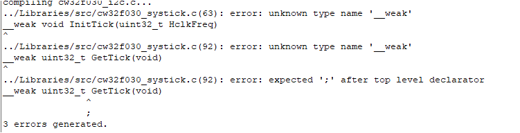  
MDK5.37开始已经不集成AC5了，想用最新版本有两个方法：  
**方法1：** 最简单的方法是先安装5.36再安装最新版本，这样AC5可以自动集成到MDK中。  
**方法2：** 安装最新版本后手动添加AC5编译器  
下载这个文件并解压出来  
  
安装完MDK后把ARMCC文件夹手动放到keil安装目录的ARM文件夹中  
  
然后在keil中手动添加，选择刚刚添加的文件夹  
  
  

## 针对AC6编译器的适配  
如果不想折腾安装AC5编译器，可以对现有工程代码修改以适应AC6的编译规则  
CW32的例程直接用AC6编译的话一般会报这个错误  
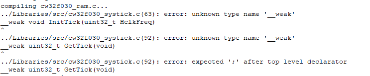  
AC6中__weak这个关键字不能被识别，改为__WEAK就好了，关键字的不同可以看这个图  
  
更多的关于MDK适配AC6的内容可以下载KEIL官方的文档进行查看  
<https://developer.arm.com/documentation/kan298/latest/>  
或者看ARM的AC6介绍，里面也有说明如何从AC5转向AC6  
<https://developer.arm.com/documentation/100068/latest/>  

## 用AC6编译有中文的代码会报-Winvalid-source-encoding的警告  
  
可以在下方如图位置填入-Wno-invalid-source-encoding 将该警告信息屏蔽  
  

## 例程移动之后编译失败  
官方例程的库函数文件没有包含在工程目录中，建议复制库函数文件夹到工程目录并删除原来的库函数文件重新添加  
  
另外还要修改头文件包含路径，以这个工程目录为例  
  
要修改成这样  
  
如果懒得自己整合库文件，可以下载群文件或网盘中的工程模板，里面已经整合好库文件  
  

## 不使用例程或模板，从头新建一个CW32的点灯工程  
先创建一个文件夹，把官方库和启动文件放进去，可以按照自己喜欢的工程创建额外的文件夹  
  
打开Keil，选择project-new uVision Project  
  
选择刚才创建的文件夹  
  
在接下来的窗口中选择你要用到的芯片  
  
在接下来的窗口中勾选  
  
按照自己喜好在工程内创建分组  
  
引入必要的库文件  
  
选择工程目录下的Libraries\src中的文件  
  
你可以直接全部添加，也可以只添加自己需要的，其中system_cw32f030.s在工程目录根目录下，这里只添加了点灯必要的  
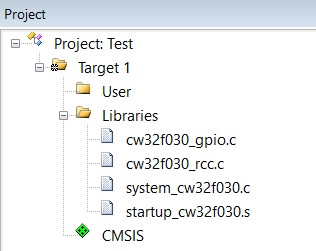  
添加库头文件路径  
  
  
这里可以手动输入路径或者点击右面的...选择文件夹  
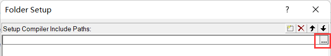  
选择工程目录中的Libraries\inc文件夹  
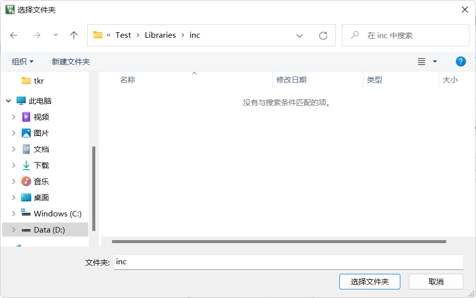  
keil会自动转为相对路径  
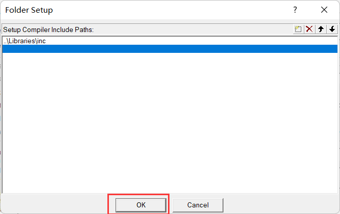  
  
如果有自己定义的头文件需要包含，也可以按照上面的流程添加，如果想使用绝对路径直接在这个界面输入路径即可，路径间用英文的;分隔  
  
接下来配置工程其它参数，仿照官方工程的参数配置即可  
  
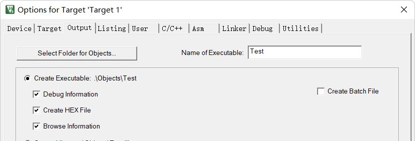  
  
  
接下来创建一个main.c文件  
  
  
在新建的main.c中写好点灯用的代码，编译并烧录运行  
  

## 编译报cmsis_version.h或__COMPILER_BARRIER的错误  
  
  
这两个都和CMSIS CORE有关，要勾选如下选项，例程里应该已经默认勾选了，注意CORE的版本，低于5.1.0勾上也还会报错，可以尝试安装网盘或群文件里的ARM.CMSIS.5.9.0.pack或者直接升级MDK  
  
ARM.CMSIS.5.9.0.pack的发布地址  
<https://github.com/ARM-software/CMSIS_5/releases>  
或者  
<https://www.keil.arm.com/packs/cmsis-arm/versions/>  

## 编译报找不到assert_failed的错误  
  
多见于自己新建的工程，两个解决方法：  
**方法1：** main.c中添加  
\#ifdef  USE_FULL_ASSERT  
void assert_failed(uint8_t *file, uint32_t line)  
{  
}  
\#endif   
**方法2：** 在base_types.h中注释掉下面的内容  
  

## 编译报L6200E:Symbol xxxx multiply defined错误
**第1种**  
  
上图的错误是某个函数被重复定义了，例如你在a.c里定义了函数void func()，在b.c里也定义了一个void func()编译时就会出现这个错误，可以根据提示到相应的源文件里修改或删除重复定义的函数。对于图中这个示例是usart.c和interrupt_cw32f030.c中都定义了UART1_IRQHandler这个函数，删掉一个即可。interrupt_cw32f030.c是官方例程提供的一个统一的中断函数入口，如果你在编程中想要在自己的文件重处理中断可以删除这个文件来避免重复定义的问题。  
**第2种**
  
这个图的错误是system_cw32f030.c在工程中被重复包含了，删除重复的只保留一个即可  

## 编译报No space in xxxxx的错误  
  
检查一下这里的配置，如果和下图配置一样的话还有这个错误那可能真的是代码超了，想办法精简一下代码  
  

## 编译报incomplete type is not allowed  
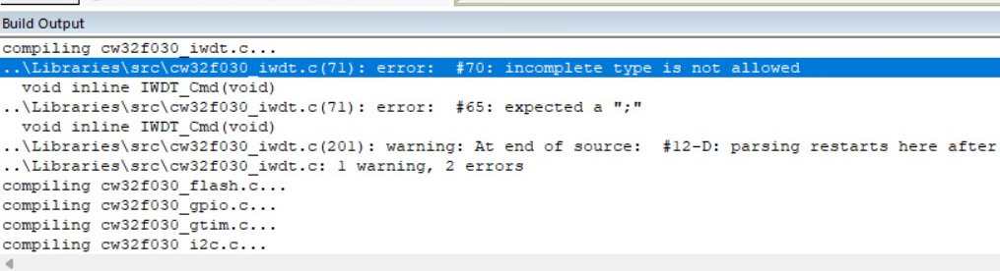  
如果报错发生在库函数中，有可能是工程设置中的C99 Mode没勾选  
  

## 烧录失败，提示Could not load file xxxxx.axf  
检查是否已经编译成功，一些新入门不熟悉开发环境的可能打开工程后直接烧录就会出现这个错误  
  
在编辑完代码后要先点击编译，编译成功后才能烧录  
  
编译失败会显示Target not created，如下图  
  
这时候就需要按照提示的错误信息修改代码并重新编译，编译成功如下图，这时就可以进行烧录了  
  

## 烧录失败  
查看是否选择了正确的烧录器  
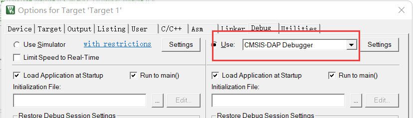  
烧录器的设置，端口这里要选SW  
  
检查连线，SWD(SWIO)接PA13 SWCK连接PA14  
  
连接正确这里会显示  
  
再查看是否选择了正确的烧录算法  
  
如果烧录时提示找不到FLM文件  
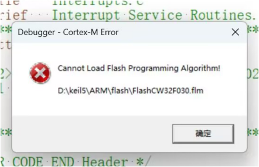  
有两个解决方法：  
**方法1：** 可以手动复制FLM文件到这个文件夹  
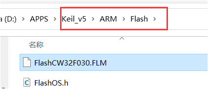  
安装完pack文件后flm文件可以在这个位置找到  
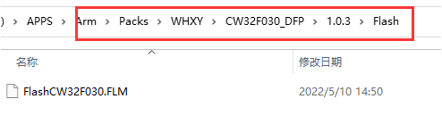  
**方法2：** 把原来的算法文件删掉重新添加，列表里找不到CW32的请确认是否安装了pack，如果已安装请确认device标签中芯片是否选择正确，如果芯片也选择正确尝试点击ok关闭工程配置窗口后再重新打开  
   
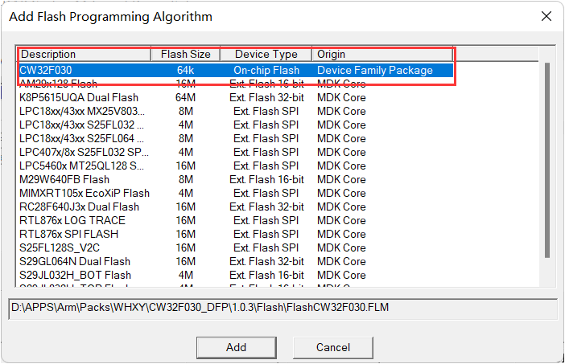  

## 如何进行ISP下载  
如果PA13 PA14被配置成普通IO导致SWD烧录不能识别，或者手头没有SWD的烧录器，可以通过串口进行ISP下载  
要进入ISP烧录模式需要将BOOT引脚上拉后再通电  
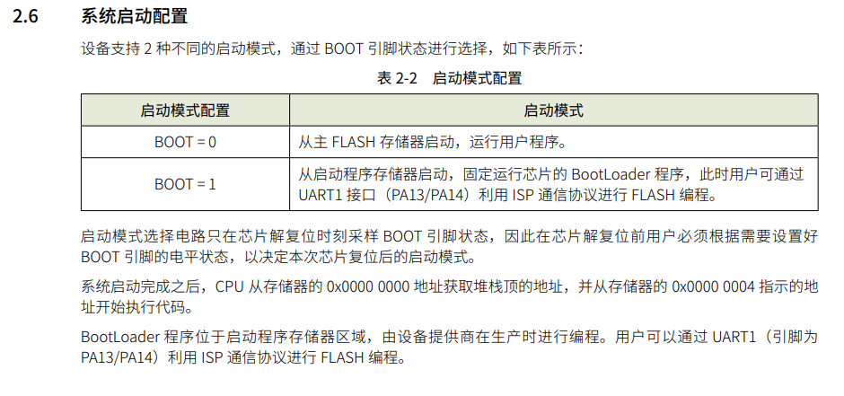  
PA13连接串口工具的TX，PA14连接串口工具的RX  
注意：针对F030要多用一根线连接串口工具的RST或DTR到芯片的RST，请注意使用的串口工具是否有RST引脚，烧录全程需要保持BOOT上拉  
打开CW32_Pragrammer，这个软件可以在武汉芯源官网下载，网盘里也有，官网下载地址<https://www.whxy.com/support/filelist/18>  
  
选择串口后点击连接  
  
选择好芯片和固件后点击在线编程即可完成烧录  
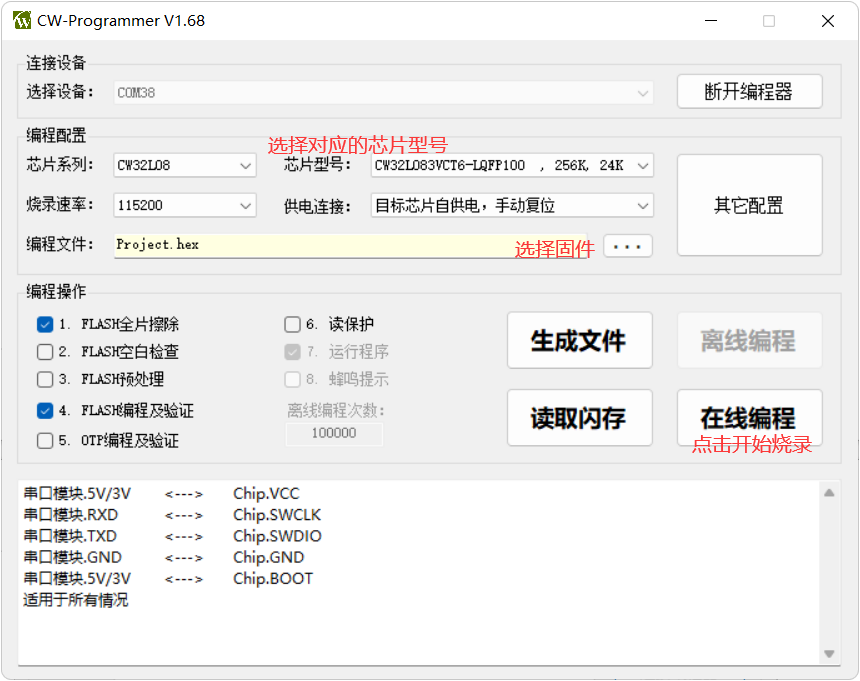  
注意：针对F030供电连接那里要选择 目标芯片自供电，RST复位  
烧录成功，感觉比用daplink还快  
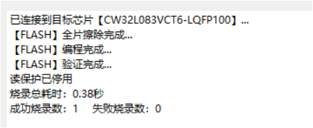  

## 饭盒派的屏幕不亮  
烧录器SWD的3.3V带不动屏幕背光，用TYPE-C数据线外接个5V供电即可  

## 小蓝板没有晶振  
没有晶振不影响使用，使用芯片内置时钟就够了，绝大部分例程也都是用的内部时钟  

## 烧录器指示灯颜色和视频或手册介绍不一样  
指示灯颜色不影响烧录器功能，能正常烧录就行  

## 程序烧录完成后不运行  
检查一下这个选项有没有勾上，没勾上的话需要手动复位或重新上电  
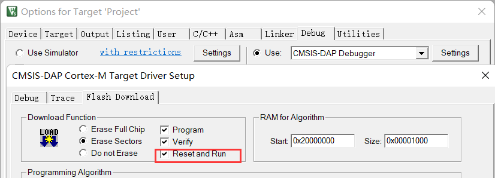  

